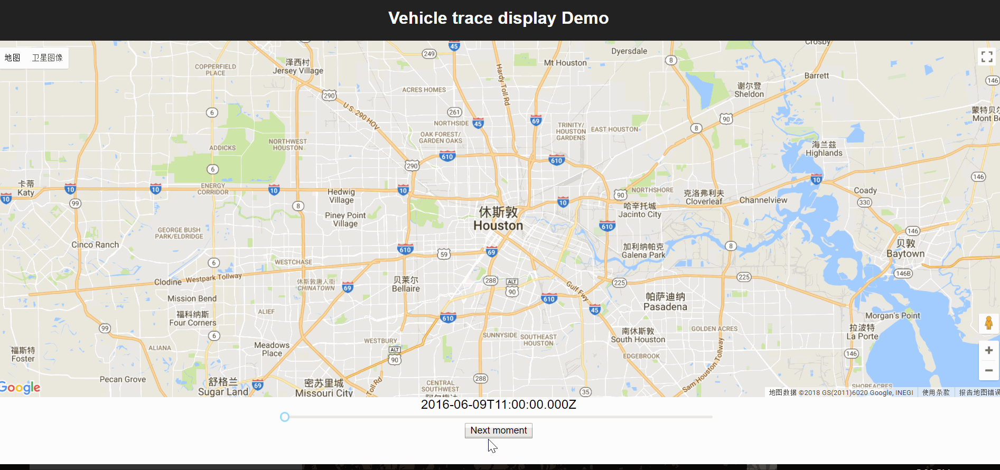

# VehicleDisplay

## Introduction
This project could fetch vehicles' location data from database and post their positions and traces onto Google Map.

## Quick Preview

As you can see, all vehicles inforamtion and traces are marked onto Google Map.

## Comments
* This repository is only for storing files, so the database configurations are not included